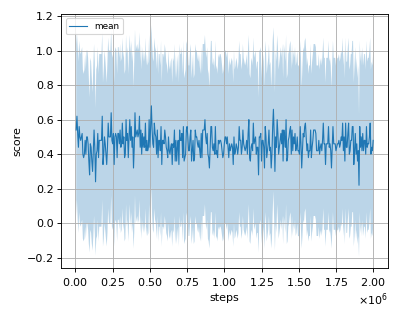
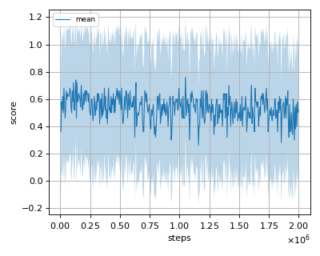
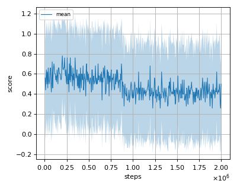

# ICRA2018QtOpt reproduction

This reproduction script trains the DQN algotirhm for continuous action enviroments proposed by Deirdre Quillen et al. in the paper: [Deep Reinforcement Learning for Vision-Based Robotic Grasping: A Simulated Comparative Evaluation of Off-Policy Methods](https://arxiv.org/abs/1802.10264).

This algorithm is a simple version of [QtOpt](https://arxiv.org/abs/1806.10293).

## Prerequisites

Install [pybullet](https://github.com/bulletphysics/bullet3) before starting the training.

```sh
$ pip install pybullet
```

## How to run the reproduction script

To run the reproduction script do

```sh
$ python icra2018qtopt_reproduction.py <options>
```

If you omit options, the script will run with gpu id 0.

You can change the gpu as follows

```sh
$ python icra2018qtopt_reproduction.py --gpu <gpu_id>
```

```sh
# Example1: run the script on cpu:
$ python icra2018qtopt_reproduction.py --gpu -1
```

To check all available options type:

```sh
$ python icra2018qtopt_reproduction.py --help
```

To check the trained result do

```sh
$ python icra2018qtopt_reproduction.py --showcase --snapshot-dir <snapshot_dir> --render
```

```sh
# Example:
$ python icra2018qtopt_reproduction.py --showcase --snapshot-dir ./KukaGraspingProceduralEnv-10k/seed-1/iteration-10000/ --render
```

Note that our reproduction code is for training the off-policy dqn training.
**At the first time to run this reproduction code, the data collection through the random policy will run, and it'll take a time.**

## Evaluation

We tested our implementation with the following Pybullet environment using different data size.

- [KukaGraspingProceduralEnv](https://github.com/google-research/google-research/blob/master/dql_grasping/grasping_env.py)

## Result

Reported score is roughly estimated from the Figure 4 of the [icra2018qtopt paper](https://arxiv.org/abs/1802.10264).
Our code is for reproducing the off-policy dql training.
(Our result of data size 1M is lower than the reported score. We are investigating this problem.)

|Env|Data size|nnabla_rl best mean score|Reported score|
|:---|:---:|:---:|:---:|
|KukaGraspingProceduralEnv|10k|0.68|~0.5|
|KukaGraspingProceduralEnv|100k|0.76|~0.7|
|KukaGraspingProceduralEnv|1M|0.78|~0.9|

## Learning curves

### KukaGraspingProceduralEnv

#### Datasize 10k



#### Datasize 100k



#### Datasize 1M

