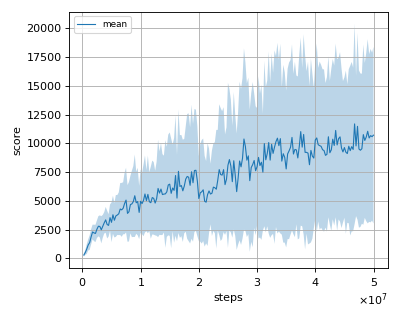
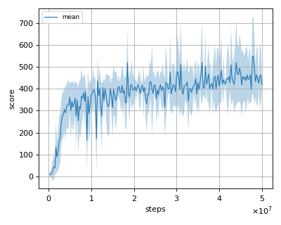

# A2C (Advantage Actor-Critic) reproduction

We tested our implementation with 5 Atari games also used in the [original paper](https://arxiv.org/abs/1602.01783).

Following Atari games was tested with 3 seeds:

- Asterix
- BreakOut
- Pong
- Qbert
- Seaquest

## Evaluation

We evaluated the algorithm in following settings.

* In every 1M frames (250K steps), the mean reward is evaluated using the Q-Network parameter at that timestep. 
* The evaluation step lasts for 500K frames (125K steps) but the last episode that exceeeds 125K timesteps is not used for evaluation.

All seeds results are combined and the mean of the score is calculated from them.

## Result

|Env|nnabla_rl best mean score|Reported score ([Reference](https://arxiv.org/pdf/1708.05144.pdf))|
|:---|:---:|:---:|
|AsterixNoFrameskip-v4|11690.807+/-8718.597|N/A|
|BreakoutNoFrameskip-v4|548.5+/-170.1|581.6|
|PongNoFrameskip-v4|20.947+/-0.223|19.9|
|QbertNoFrameskip-v4|14759.859+/-1437.363|15967.4|
|SeaquestFrameskip-v4|1770.909+/-65.039|1754.0|

**NOTE: Our A2C was trained with 16 threads.**

## Learning curves

### Asterix

### Breakout

### Pong

### Qbert

### Seaquest

