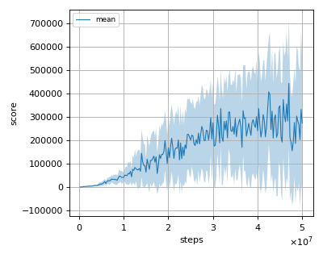
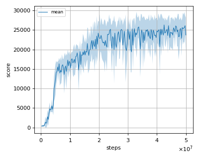
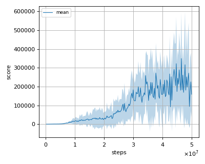

# C51 (Categorical DQN with 51 atoms) reproduction

This reproduction script trains the C51 (Categorical DQN with 51 atoms) algorithm proposed by M. G. Bellemare, et al. in the paper: [A Distributional Perspective on Reinforcement Learning](https://arxiv.org/abs/1707.06887).

We tested our implementation with 5 Atari games also used in the [original paper](https://arxiv.org/pdf/1707.06887.pdf) using 3 differnt initial random seeds:

- Asterix
- Breakout
- Pong
- Qbert
- Seaquest

## Evaluation

We evaluated the algorithm in following settings.

* In every 1M frames (250K steps), the mean reward is evaluated using the Q-Network parameter at that timestep. 
* The evaluation step lasts for 500K frames (125K steps) but the last episode that exceeeds 125K timesteps is not used for evaluation.
* epsilon is set to 0.001 (not greedy).

Mean evaluation score is the mean score among 3 seeds at each iteration.

## Result

|Env|nnabla_rl best mean score|Reported score|
|:---|:---:|:---:|
|AsterixNoFrameskip-v4|450286.364+/-342066.032|406211|
|BreakoutNoFrameskip-v4|623.75+/-208.36|748|
|PongNoFrameskip-v4|20.995+/-0.067|21.0|
|QbertNoFrameskip-v4|26228.958+/-2191.249|26387.5|
|SeaquestFrameskip-v4|142828.571+/-197219.983|266434|

## Learning curves

### Asterix

### Breakout

### Pong

### Qbert

### Seaquest

