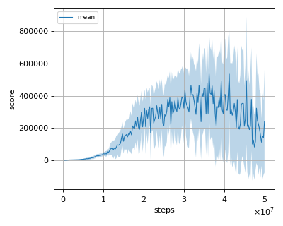
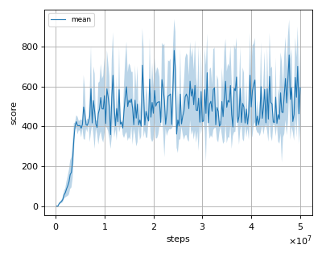
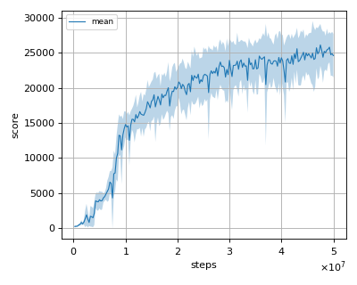
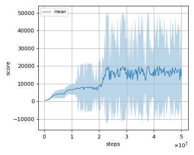

# Munchausen IQN (Munchausen Implicit Quantile Network) reproduction

We tested our implementation with Atari games also used in the [original paper](https://proceedings.neurips.cc/paper/2020/file/2c6a0bae0f071cbbf0bb3d5b11d90a82-Paper.pdf).  

Following Atari games was tested with 3 seeds:

- Asterix
- BreakOut
- Pong
- Qbert
- Seaquest

## Evaluation

We evaluated the algorithm in following settings.

* In every 1M frames (250K steps), the mean reward is evaluated using the Q-Network parameter at that timestep. 
* The evaluation step lasts for 500K frames (125K steps) but the last episode that exceeeds 125K timesteps is not used for evaluation.
* epsilon is set to 0.001 (not greedy).

All seeds results are combined and the mean of the score is calculated from them.

## Result

|Env|nnabla_rl best mean score|Reported score|
|:---|:---:|:---:|
|AsterixNoFrameskip-v4|535135.417+/-250835.596|49865|
|BreakoutNoFrameskip-v4|782.167+/-157.641|320|
|PongNoFrameskip-v4|20.987+/-0.114|19|
|QbertNoFrameskip-v4|26152.199+/-2989.044|14739|
|SeaquestFrameskip-v4|19862.857+/-30763.661|23885|

## Learning curves

### Asterix

### Breakout

### Pong

### Qbert

### Seaquest

