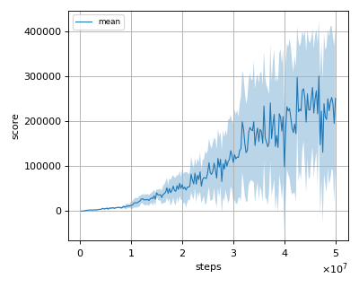
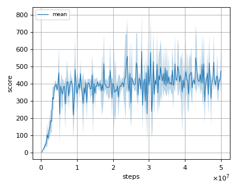

# QR-DQN (Distributional Reinforcement Learning with Quantile Regression) reproduction

We tested our implementation with 5 Atari games also used in the [original paper](https://arxiv.org/abs/1710.10044).  

Following Atari games was tested with 3 seeds:

- Asterix
- BreakOut
- Pong
- Qbert
- Seaquest

## Evaluation

We evaluated the algorithm in following settings.

* In every 1M frames (250K steps), the mean reward is evaluated using the Q-Network parameter at that timestep. 
* The evaluation step lasts for 500K frames (125K steps) but the last episode that exceeeds 125K timesteps is not used for evaluation.
* epsilon is set to 0.001 (not greedy).

All seeds results are combined and the mean of the score is calculated from them.

## Result

|Env|nnabla_rl best mean score|Reported score (QR-DQN-1)|
|:---|:---:|:---:|
|AsterixNoFrameskip-v4|300921.818+/-122332.793|261025|
|BreakoutNoFrameskip-v4|588.0+/-218.113|742|
|PongNoFrameskip-v4|20.995+/-0.067|21.0|
|QbertNoFrameskip-v4|22146.078+/-4277.151|572510|
|SeaquestFrameskip-v4|37646.667+/-26759.052|8268|

## Learning curves

### Asterix

### Breakout

### Pong

### Qbert

### Seaquest

