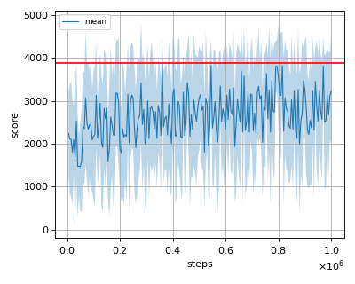
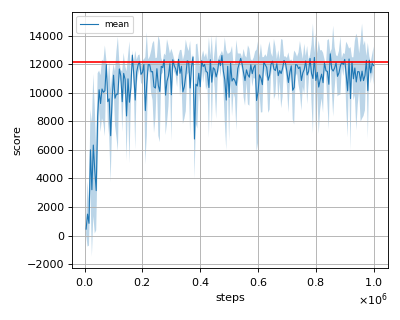
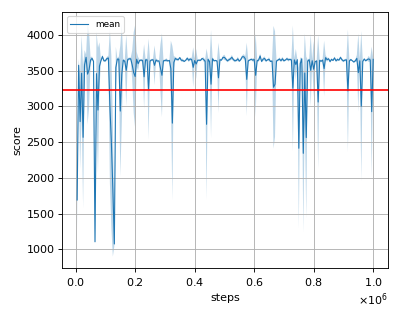
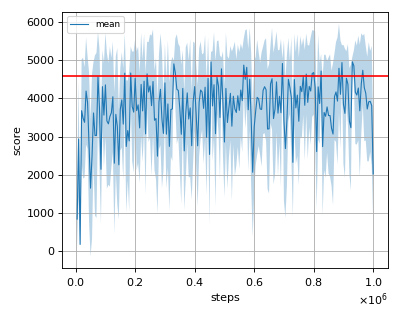

# BCQ (Batch Constrained Q-learning) reproduction

## Prerequisites

Install [d4rl](https://github.com/rail-berkeley/d4rl) before starting the training. (And also you'll need the mujoco software license to use mujoco)

```sh
$ pip install git+https://github.com/rail-berkeley/d4rl@master#egg=d4rl
```

## Run training

Use d4rl env for reproduction (This reproduction code only supports mujoco environment provided in d4rl).

```sh
$ python bcq_reproduction.py --env='ant-expert-v0'
```

## Tested environments

- ant-expert-v0
- halfcheetah-expert-v0
- hopper-expert-v0
- walker2d-expert-v0

## Reproduction results

Red horizontal line is the dataset's agent score. </br>
Shaded region is the standard deviation of evaluation score. </br>
The tested environment is not completely same as the original paper but the result is similar to that of imitation performance presented in the [BCQ paper](https://arxiv.org/pdf/1812.02900.pdf).

### ant-expert-v0



### halfcheetah-expert-v0



### hopper-expert-v0



### walker2d-expert-v0


